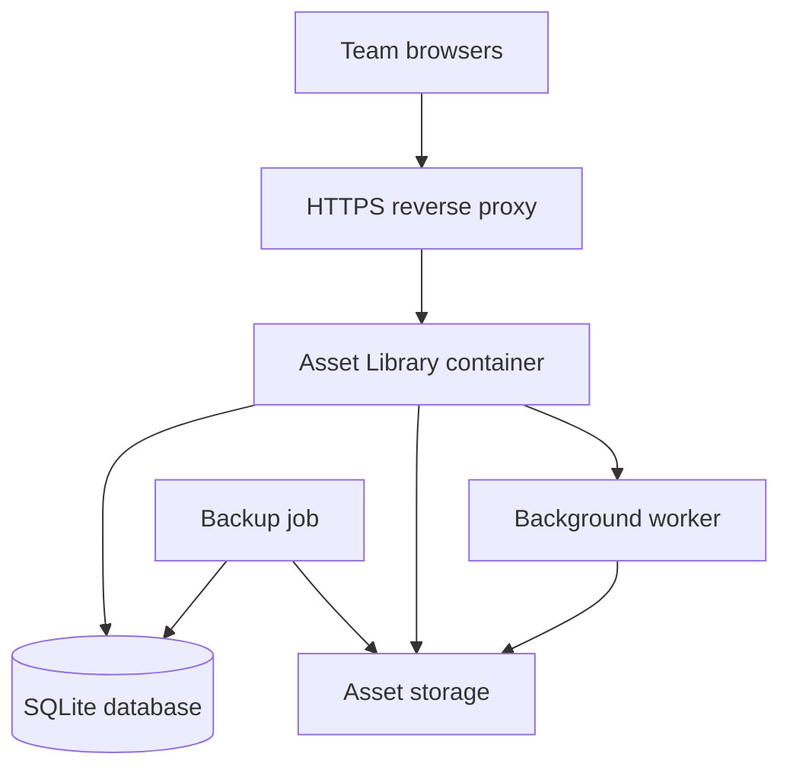

# Kellojo Asset Library Extension

## Agent Build Plan and Initial Project Setup

**Document status:** Initial implementation brief  
**Upstream project:** [Kellojo/asset-library](https://github.com/Kellojo/asset-library)  
**Upstream license:** MIT  
**Baseline reviewed:** `main` at commit `bd9e9b461581d824fb6319f8adb00ae4542fd070`  
**Primary goal:** Turn Kellojo Asset Library into a secure, multi-user, self-hosted game-development asset manager for a small team, with a path toward Unreal Engine and Blender integration.

---

## 1. How to Use This Document

This file serves two purposes:

1. **Owner setup guide:** Follow Part I to fork, clone, run, and protect the initial project.
2. **Coding-agent brief:** Give Part II onward to a coding agent working inside the repository.

Do not ask the agent to implement the entire roadmap in one pass. Complete one milestone at a time, require tests and a working build at each checkpoint, and review the result before starting the next milestone.

The first development release should focus on **accounts, permissions, auditability, and safe database migrations**. Game-specific catalog features come after the security foundation.

---

# Part I — Initial Project Setup for the Owner

## 2. Prerequisites

Install or prepare:

- A GitHub account.
- Git.
- Node.js compatible with the checked-in project. The current Dockerfile uses Node 25 Alpine. For local development, use the version declared by the repository if it gains an `.nvmrc`; otherwise use a current compatible Node release and keep the lockfile authoritative.
- npm.
- Docker Engine with the Docker Compose plugin for deployment.
- A code editor such as JetBrains Rider, VS Code, or WebStorm.
- Optional: LM Studio or another OpenAI-compatible endpoint for AI metadata.

Verify the local tools:

```bash
git --version
node --version
npm --version
docker --version
docker compose version
```

## 3. Fork the Upstream Repository

1. Open [github.com/Kellojo/asset-library](https://github.com/Kellojo/asset-library).
2. Select **Fork**.
3. Keep the upstream project name or choose a distinct name such as `game-asset-library`.
4. Create the fork under your GitHub account or organization.
5. Keep the fork public if you intend to distribute your MIT-licensed changes; use a private fork if this is initially an internal experiment.

The upstream project is MIT licensed. Preserve its copyright and license notice. Record major upstream changes separately from your extension work so future merges remain manageable.

## 4. Clone the Fork and Register Upstream

Replace `<YOUR-GITHUB-NAME>` and, if changed, the repository name:

```bash
git clone https://github.com/<YOUR-GITHUB-NAME>/asset-library.git
cd asset-library
git remote add upstream https://github.com/Kellojo/asset-library.git
git remote -v
```

Create the long-lived extension branch:

```bash
git switch -c develop
git push -u origin develop
```

Use short-lived feature branches from `develop`:

```bash
git switch develop
git pull --ff-only
git switch -c feature/auth-rbac
```

Recommended branch policy:

- `main`: stable, deployable releases.
- `develop`: integrated development.
- `feature/*`: one milestone or focused feature.
- `fix/*`: isolated corrections.

## 5. Record the Upstream Baseline

Before modifying code:

```bash
git fetch upstream
git rev-parse upstream/main
git tag upstream-baseline-$(date +%Y-%m-%d) upstream/main
git push origin --tags
```

On PowerShell, use a literal tag name if date expansion differs:

```powershell
git tag upstream-baseline-2026-09-22 upstream/main
git push origin --tags
```

## 6. Run the Existing Application Locally

Install exactly from the lockfile, then validate the baseline:

```bash
npm ci
npm run check
npm run build
npm run dev
```

Open [http://localhost:5173](http://localhost:5173).

Test the unmodified application with disposable assets:

- Upload an image, audio file, text/script file, and GLB model.
- Confirm search and filtering.
- Confirm preview, download, edit, replace, and delete behavior.
- Upload a duplicate and confirm hash-based duplicate detection.
- Stop and restart the application and confirm metadata persists.

The app creates runtime state beneath `data/`:

```text
data/
├── assets.db
├── ai-config.json
└── uploads/
```

Do not commit `data/`, real assets, database files, AI keys, session secrets, or production configuration.

## 7. Create Local Configuration

Copy the example environment file if present:

```bash
cp .env.example .env
```

On PowerShell:

```powershell
Copy-Item .env.example .env
```

For the authentication milestone, the agent must introduce and document at least these variables:

```dotenv
ORIGIN=http://localhost:5173
AUTH_SECRET=replace-with-a-long-random-secret
INITIAL_ADMIN_EMAIL=admin@example.com
INITIAL_ADMIN_PASSWORD=replace-with-a-one-time-strong-password
BODY_SIZE_LIMIT=1G
PUBLIC_UPLOAD_PARALLELISM=4
```

Generate a session secret rather than inventing one manually:

```bash
openssl rand -base64 48
```

The initial administrator password must be used only for bootstrap. Force a password change on first login or replace the bootstrap mechanism with a one-time CLI command before public deployment.

## 8. Protect the Baseline Before Agent Work

Run and record:

```bash
npm run check
npm run build
git status
```

Commit only intentional setup changes:

```bash
git add .
git commit -m "chore: establish extension development baseline"
git push
```

If no files changed, do not make an empty commit.

## 9. Initial Docker Test

The upstream deployment uses port `3000` and persists `/app/data`. Before authentication exists, expose it only to the local machine or trusted LAN.

```bash
docker compose up -d --build
docker compose logs -f asset-library
```

Open [http://localhost:3000](http://localhost:3000).

Stop the test stack without deleting its persistent data:

```bash
docker compose down
```

Do not run `docker compose down -v` against valuable data.

## 10. Recommended Development Workflow

For every milestone:

1. Create a feature branch from current `develop`.
2. Give the agent only the current milestone plus the global guardrails in this document.
3. Require the agent to inspect the repository before proposing code changes.
4. Approve the plan, then let it implement.
5. Require tests, `npm run check`, and `npm run build`.
6. Review migrations, authorization checks, secrets, file operations, and deletion behavior manually.
7. Merge into `develop` only after validation.
8. Deploy to a test instance using a copy of the data directory.
9. Merge a tested release into `main` and tag it.

Suggested release commands:

```bash
git switch main
git merge --no-ff develop
git tag -a v0.1.0 -m "Multi-user foundation"
git push origin main --tags
```

## 11. Keeping the Fork Current

Do this on a clean worktree:

```bash
git fetch upstream
git switch develop
git merge upstream/main
npm ci
npm run check
npm run build
git push origin develop
```

Resolve upstream conflicts on a dedicated branch if the extension has become substantial. Never merge upstream directly into production without running migrations and regression tests against a copied database.

---

# Part II — Coding Agent Mission

## 12. Agent Role

You are extending an existing open-source SvelteKit application. Work incrementally, preserve upstream behavior, and keep the fork mergeable where practical.

Your first responsibility is to inspect the live repository. This document describes the reviewed baseline, but the checked-out code is authoritative. If the repository has changed, report the differences before implementation and adapt the plan without silently discarding requirements.

## 13. Current Architecture Summary

At the reviewed baseline, the project uses:

- SvelteKit 2 and Svelte 5.
- TypeScript and Vite.
- `@sveltejs/adapter-node` for production.
- Node's built-in synchronous SQLite API (`node:sqlite`).
- A SQLite database at `data/assets.db`.
- Uploaded files beneath `data/uploads/`.
- SvelteKit REST endpoints beneath `src/routes/api/`.
- Central server-side asset persistence in `src/lib/server/assets.ts`.
- Three.js for supported model previews.
- WaveSurfer.js for audio previews.
- Fuse.js for client-side fuzzy search.
- An OpenAI-compatible chat-completions endpoint for AI metadata.
- Docker Compose and a multi-stage Node Alpine image.

The current asset table stores one database record per uploaded file and includes title, description, JSON tags/licenses, source URL, upload metadata, stored filename, hash, MIME type, category, preview kind, and optional image dimensions.

Known baseline limitations:

- No user accounts, sessions, or permissions.
- No request identity in `App.Locals`.
- No audit log.
- No explicit migration system; schema creation is embedded in application startup.
- One uploaded file is treated as one asset.
- Files must be uploaded into managed storage; there is no non-destructive external library scanner.
- Search loads the asset set and relies substantially on client-side logic.
- There is no Unreal or Blender integration API.
- There is no established automated test suite in the reviewed baseline.

## 14. Product Vision

Build a self-hosted asset library for a small game-development team. Users should be able to securely browse, search, preview, upload, organize, and download shared assets from a browser. The system should eventually understand logical game assets, not merely individual files.

Example logical asset:

```text
Medieval Barrel
├── Source
│   └── Barrel.blend
├── Exchange
│   ├── Barrel.fbx
│   └── Barrel.glb
├── Textures
│   ├── Barrel_BaseColor.png
│   ├── Barrel_Normal.png
│   └── Barrel_ORM.png
├── Variants and LODs
├── Preview media
├── License and provenance
└── Engine import profiles
```

Primary consumers:

- Library administrator.
- Game developers.
- 3D artists and animators.
- Read-only guests or contractors.
- Future Unreal Engine editor plugin.
- Future Blender add-on.

## 15. Non-Negotiable Engineering Rules

1. Never weaken authentication or authorization to make a test pass.
2. Every state-changing endpoint must verify identity, permission, input, and ownership/scope as applicable.
3. Protect file endpoints as carefully as metadata endpoints. Knowing a URL must not bypass permission checks.
4. Use parameterized SQL only.
5. Do not log passwords, session tokens, API keys, reset tokens, or complete private asset URLs.
6. Store password verifiers using a reputable memory-hard password hashing implementation such as Argon2id. Do not create custom cryptography.
7. Use opaque, hashed, revocable session tokens in secure, `HttpOnly`, `SameSite=Lax` cookies. Use `Secure` cookies outside local development.
8. Enforce CSRF protection for cookie-authenticated state changes. Validate `Origin`/trusted origins and use framework-supported protections.
9. Prevent path traversal. Stored paths must be generated server-side and resolved under configured storage roots.
10. Treat file names, MIME types, extensions, embedded metadata, and AI output as untrusted.
11. Do not render uploaded HTML/SVG/script content in a same-origin executable context.
12. Preserve original files unless the user intentionally replaces or deletes them.
13. Implement migrations that can upgrade an existing installation without losing assets.
14. Create a backup before migration and document rollback limits.
15. Destructive bulk actions need explicit confirmation, authorization, and audit entries.
16. Avoid large unrelated rewrites. Keep commits scoped and reviewable.
17. Add tests for every authorization boundary and migration.
18. Do not expose the application directly to the public internet before the auth milestone is complete.

## 16. Definition of Done for Every Milestone

A milestone is complete only when:

- The agreed scope is implemented.
- Existing supported workflows continue to work or an intentional change is documented.
- New database changes use ordered migrations.
- Unit/integration tests cover core behavior and failure cases.
- Unauthorized and forbidden cases are explicitly tested.
- `npm run check` passes.
- `npm run build` passes.
- The production Docker image builds and starts.
- Documentation and `.env.example` are updated.
- No secrets or runtime data are committed.
- The agent provides a concise change summary, migration notes, validation results, known limitations, and next recommended step.

---

# Part III — Delivery Roadmap

## 17. Milestone 0 — Baseline Audit and Test Harness

### Goal

Make the current system safe to extend without changing its product behavior.

### Required work

- Inspect the entire repository and report the true structure, data flow, and API surface.
- Record the upstream commit used as the implementation baseline.
- Add an explicit supported Node version (`.nvmrc` or equivalent) aligned with production.
- Add test tooling appropriate for SvelteKit/TypeScript. Prefer Vitest for server/unit tests and Playwright for essential browser flows unless repository constraints indicate otherwise.
- Add fixture helpers that use temporary directories and disposable SQLite databases.
- Add baseline tests for:
  - asset creation;
  - duplicate hash rejection;
  - metadata update;
  - file download;
  - asset deletion;
  - path containment;
  - legacy JSON-to-SQLite migration if retained.
- Add lint/format scripts only if configured consistently and without reformatting the entire project in the same feature commit.
- Add a CI workflow for install, check, test, and build.

### Acceptance criteria

- Tests never read or mutate the developer's real `data/` directory.
- Existing manual workflows still function.
- CI runs on pull requests.
- The agent identifies security and data-loss risks before starting Milestone 1.

## 18. Milestone 1 — Database Migrations

### Goal

Replace ad hoc schema initialization with versioned, transactional migrations suitable for long-lived installations.

### Required work

- Introduce a `schema_migrations` table.
- Store migrations as ordered code or SQL files with stable IDs.
- Execute unapplied migrations inside transactions during controlled startup.
- Make migrations idempotent at the migration-runner level.
- Preserve existing asset rows and uploaded files.
- Back up `assets.db` before applying a new schema version, using a documented, bounded retention policy.
- Refuse unsafe downgrades.
- Add a health/readiness check that distinguishes database failure from normal startup.

### Acceptance criteria

- A copy of the original database upgrades without data loss.
- A fresh database reaches the same final schema.
- Re-running startup does not reapply completed migrations.
- A deliberately failing migration rolls back cleanly.

## 19. Milestone 2 — Authentication and Sessions

### Goal

Require a real account for every application and API request except login, health checks, and explicitly public static files.

### Proposed tables

```text
users
- id
- email_normalized (unique)
- display_name
- password_hash
- status: active | disabled | invited
- must_change_password
- created_at
- updated_at
- last_login_at

sessions
- id
- user_id
- token_hash (unique)
- created_at
- expires_at
- last_seen_at
- revoked_at
- user_agent_summary (optional)
- ip_summary (optional, privacy-conscious)

password_reset_tokens or invitations
- id
- user_id
- token_hash
- expires_at
- consumed_at
```

### Required work

- Add secure login and logout.
- Populate typed `App.Locals.user` and session data in a server hook.
- Protect all page routes and API routes by default.
- Build a one-time administrator bootstrap flow.
- Add rate limiting/backoff for login attempts.
- Rotate the session token after login and privilege changes.
- Revoke sessions when users are disabled or passwords are reset.
- Add account/profile UI for display name and password change.
- Do not add public self-registration in the first release.

### Acceptance criteria

- An anonymous request cannot enumerate assets or retrieve an asset file.
- Login errors do not reveal whether an account exists.
- Disabled users and expired/revoked sessions cannot access the library.
- Cookies have correct production security attributes.
- Restarting the application does not invalidate valid persistent sessions unless intentionally configured.

## 20. Milestone 3 — Role-Based Access Control and User Administration

### Goal

Allow a few users to collaborate with least-privilege permissions.

### Initial roles

| Role | Browse/preview | Download | Upload | Edit metadata | Replace files | Delete assets | Manage users/settings |
|---|---:|---:|---:|---:|---:|---:|---:|
| Administrator | Yes | Yes | Yes | Yes | Yes | Yes | Yes |
| Manager | Yes | Yes | Yes | Yes | Yes | Yes | No |
| Contributor | Yes | Yes | Yes | Own/all per policy | Own/all per policy | No by default | No |
| Viewer | Yes | Yes by policy | No | No | No | No | No |

Implement permissions as named capabilities rather than scattering role-name comparisons throughout endpoints.

Suggested capabilities:

```text
asset.read
asset.download
asset.create
asset.update
asset.replace
asset.delete
asset.bulk_manage
user.read
user.manage
settings.manage
audit.read
```

### Required work

- Add roles, capabilities, and user-role assignments.
- Centralize authorization helpers on the server.
- Apply checks to every page action and API endpoint.
- Add an admin UI to invite/create, disable, reactivate, and assign roles.
- Prevent removal or disabling of the final active administrator.
- Add policy tests that enumerate roles against protected operations.

### Acceptance criteria

- UI controls reflect permissions, but server enforcement remains authoritative.
- Direct API calls cannot bypass hidden UI actions.
- File and thumbnail/preview access uses the same read policy as metadata.
- User administration creates audit events.

## 21. Milestone 4 — Audit Log and Operational Safety

### Goal

Make multi-user changes traceable and recoverable.

### Required work

- Add append-oriented audit events for authentication, user administration, asset upload, metadata changes, replacement, download if desired, and deletion.
- Record actor, action, target, timestamp, outcome, and a safe structured summary.
- Never record secrets or complete sensitive request payloads.
- Add admin filtering by user, action, asset, and date.
- Add a soft-delete/trash stage for assets before permanent deletion.
- Define retention and restore behavior.
- Add database and upload backup/restore documentation.

### Acceptance criteria

- Deleted items can be restored during the retention window.
- Audit events survive normal asset deletion.
- Administrators can determine who changed an asset and when.

## 22. Milestone 5 — Logical Assets and Multiple Files

### Goal

Separate a cataloged asset from its individual files.

### Proposed model

```text
assets
- id
- title
- description
- asset_type
- status
- source_url
- created_by
- created_at
- updated_at

asset_files
- id
- asset_id
- role: source | model | texture | animation | audio | preview | document | other
- variant
- original_name
- stored_name or storage_uri
- hash
- mime_type
- size
- metadata_json
- created_by
- created_at

tags / asset_tags
licenses / asset_licenses
asset_relations
```

### Required work

- Migrate each legacy asset record into one logical asset with one asset file.
- Preserve stable asset IDs or provide a compatibility map.
- Support multiple files, variants, LODs, texture maps, and source/exchange formats.
- Add file roles and per-file preview/download.
- Retain provenance and licensing at the logical asset level, with optional file-level overrides.
- Add asset-pack/container relationships.

### Acceptance criteria

- No legacy item is lost during migration.
- A single catalog entry can include `.blend`, `.fbx`, `.glb`, textures, animations, and documentation.
- Replacing one derivative file does not replace unrelated files.

## 23. Milestone 6 — Non-Destructive External Library Scanning

### Goal

Index existing local/NAS asset folders without requiring them to be copied into application-managed uploads.

### Required work

- Define storage roots only through administrator configuration.
- Store paths relative to a configured root; never accept arbitrary absolute paths from normal users.
- Add scheduled and manual scans.
- Track discovered, missing, modified, and ignored files.
- Use fast metadata checks before hashing; hash in a bounded background queue.
- Add ignore patterns and supported-extension configuration.
- Never modify or delete source files during scanning.
- Add a review/import queue before automatically creating or merging logical assets.
- Design for unavailable NAS mounts without marking everything permanently deleted.

### Acceptance criteria

- A read-only mounted folder can be indexed.
- Rescanning is incremental.
- Path traversal and symlink escape tests pass.
- Missing storage is reported as unavailable, not interpreted as mass deletion.

## 24. Milestone 7 — Game Asset Metadata and Previews

### Goal

Make models, materials, textures, animations, and audio first-class game-development assets.

### Required capabilities

- PBR texture-set detection: Base Color/Albedo, Normal, ORM/RMA, Roughness, Metallic, AO, Emissive, Opacity, Height/Displacement.
- Model metadata: format, triangles/vertices where extractable, materials, bounds, units, axes, LODs, skeleton/rig presence, embedded animation count.
- Animation metadata: skeleton identifier, clips, duration, frame rate, root motion indicator where reliable.
- Audio metadata: duration, channels, sample rate, bit depth, loop markers where supported.
- Configurable thumbnails and proxy generation through isolated background jobs.
- Preview failure must never corrupt or block access to the original.

Do not execute scripts or load untrusted Blender files inside the web process. External conversion tools must run with resource limits and isolated temporary directories.

## 25. Milestone 8 — Search, Scale, and Background Jobs

### Goal

Support large libraries without loading the complete catalog into every browser.

### Required work

- Move filtering, sorting, and pagination to the server.
- Add indexed database queries and full-text search suitable for SQLite, or document the threshold for a future PostgreSQL/search service migration.
- Add durable background jobs for hashing, metadata extraction, AI tagging, and preview generation.
- Add job retry, cancellation, progress, failure visibility, and concurrency limits.
- Add bulk tagging, metadata update, download/export, and soft delete.
- Measure with a representative synthetic catalog before optimizing.

### Acceptance criteria

- Browsing stays responsive with at least tens of thousands of records in the benchmark dataset.
- The browser does not download the full catalog for initial rendering.
- Restarting the server does not silently lose durable queued work.

## 26. Milestone 9 — Integration API, Unreal Plugin, and Blender Add-on

### Goal

Allow authenticated desktop tools to search and retrieve assets without sharing a user's browser password.

### API foundation

- Personal access tokens with named scopes, expiration, hashing, revocation, and last-used timestamps.
- Versioned endpoints such as `/api/v1/...`.
- Server-side search and structured metadata.
- Download manifests containing files, hashes, roles, licenses, and suggested import settings.
- Conditional/range requests for large files where practical.
- Clear error contracts and OpenAPI documentation.

### Unreal Engine plugin — later subproject

- Authenticate with a scoped token stored using platform-appropriate secure storage.
- Browse/search from an Editor tab.
- Preview metadata and license before import.
- Download to a controlled staging directory.
- Verify checksums.
- Import through Unreal's supported asset import pipeline.
- Apply saved import profiles.
- Record project usage back to the server only with user consent and the appropriate scope.

### Blender add-on — later subproject

- Browse/search from a sidebar.
- Download/link/import selected assets.
- Respect logical file roles and variants.
- Publish approved exports back as new derivatives without overwriting sources.

---

# Part IV — First Agent Assignment

## 27. Copy/Paste Prompt for the Coding Agent

Use the following prompt after cloning your fork and placing this document in the repository:

```text
You are working in a fork of Kellojo/asset-library.

Read Kellojo-Asset-Library-Extension-Agent-Plan.md completely, then inspect the entire repository. The checked-out code is authoritative. Do not implement the full roadmap.

Your assignment is Milestone 0 only: baseline audit and test harness.

Before editing:
1. Report the current commit, repository structure, application data flow, database initialization, API endpoints, file-storage behavior, and build/deployment workflow.
2. Identify differences between the checked-out repository and the baseline described in the plan.
3. Identify concrete security, data-loss, migration, and testability risks.
4. Propose a scoped implementation plan and list the files you expect to change.
5. Wait for approval before editing.

After approval:
- Implement only Milestone 0.
- Keep tests isolated from the real data directory.
- Do not perform a broad refactor or formatting pass.
- Preserve current functionality.
- Run all applicable tests, npm run check, npm run build, and a Docker build.
- Update developer documentation and CI.
- Finish with a concise summary of changes, commands run and results, known limitations, and the proposed Milestone 1 handoff.

Follow every rule and Definition of Done in the plan. Never commit secrets, runtime data, uploaded assets, or a real SQLite database.
```

## 28. Prompt for the Authentication Milestone

Use this only after Milestones 0 and 1 are merged and validated:

```text
Read Kellojo-Asset-Library-Extension-Agent-Plan.md and inspect the current repository. Implement Milestone 2 only: authentication and sessions.

First provide a design covering:
- exact schema migration;
- password-hashing library and parameters;
- opaque session-token design and storage;
- cookie settings;
- SvelteKit hook and App.Locals types;
- default-deny page/API protection;
- administrator bootstrap;
- login rate limiting;
- CSRF/origin protection;
- test matrix;
- upgrade and rollback considerations.

Do not edit until the design is approved. Do not implement public registration, OAuth, RBAC, logical assets, or external scanning in this milestone. Preserve all existing asset behavior for an authenticated administrator.

After implementation, demonstrate with tests that anonymous users cannot list metadata, preview files, download files, upload, edit, replace, or delete assets.
```

---

# Part V — Deployment for a Small Team

## 29. Target Topology



For a handful of users, SQLite can remain reasonable if writes are controlled and backups are correct. Revisit PostgreSQL only when measured concurrency, operational needs, or background work justify it.

## 30. Hardened Compose Direction

The agent should eventually provide a production example similar in intent to the following. Do not treat this illustrative configuration as complete until authentication, health checks, container user permissions, and your reverse proxy are verified.

```yaml
services:
  asset-library:
    build:
      context: .
    restart: unless-stopped
    environment:
      ORIGIN: https://assets.example.com
      AUTH_SECRET: ${AUTH_SECRET}
      BODY_SIZE_LIMIT: 4G
      PUBLIC_UPLOAD_PARALLELISM: 4
    volumes:
      - ./data:/app/data
    expose:
      - "3000"
    networks:
      - proxy

networks:
  proxy:
    external: true
```

Keep the app port private to the Docker network and publish only through an HTTPS reverse proxy. If direct LAN access is temporarily necessary, bind to an explicit trusted interface rather than all interfaces.

## 31. Reverse Proxy Requirements

Configure the reverse proxy to:

- Terminate HTTPS.
- Forward the original host and protocol.
- Permit the intended maximum upload size.
- Use timeouts appropriate for large uploads without becoming unlimited.
- Rate-limit login and other abuse-prone endpoints.
- Preserve streaming/range behavior if implemented.
- Add safe security headers after verifying preview compatibility.

For nginx, the upload-size setting will commonly need to align with the application limit:

```nginx
client_max_body_size 4G;
```

Do not expose the current upstream application publicly before authentication is implemented; the upstream README explicitly warns against unauthenticated internet exposure.

## 32. Backup Plan

Back up the database and files as one recoverable application state.

Minimum policy:

- Daily automated backup.
- Multiple retained versions.
- At least one copy on a different device or storage system.
- Encryption for off-site backup.
- Periodic restore test into an isolated environment.
- Backup before every application upgrade or schema migration.

For SQLite, do not blindly copy an actively written database unless using a supported SQLite backup method or a coordinated application pause/checkpoint. The agent must document the exact safe procedure implemented for this project.

## 33. Deployment Checklist

- [ ] Auth and RBAC milestones completed and tested.
- [ ] Production secrets generated outside source control.
- [ ] Initial admin password changed.
- [ ] HTTPS works and HTTP redirects safely.
- [ ] Application port is not unintentionally public.
- [ ] Reverse-proxy upload limit matches the app.
- [ ] Data volume is persistent and has correct ownership.
- [ ] Health/readiness endpoint is monitored.
- [ ] Backup completed and restore tested.
- [ ] A non-admin account cannot access admin operations.
- [ ] A viewer cannot upload, edit, replace, or delete.
- [ ] Direct file URLs require authorization.
- [ ] Audit entries appear for administrative and destructive actions.
- [ ] Upgrade and rollback instructions are documented.

---

# Part VI — Product Decisions to Defer Until Evidence Exists

## 34. Avoid Premature Commitments

Do not decide these during the first milestone unless implementation requires it:

- SQLite versus PostgreSQL at scale.
- Object storage versus filesystem/NAS storage.
- Whether AI-generated metadata should be automatic or review-only.
- Exact semantic-search/vector database.
- Unreal-first versus Blender-first desktop integration.
- Public sharing links.
- Organization/tenant isolation.
- Cloud-hosted deployment.

Collect real usage data first: number and total size of assets, file-type distribution, peak concurrent users, scan duration, search latency, preview failure rate, and the most common import workflows.

## 35. Recommended First Release Scope

Version `0.1.0` should include only:

- Reliable migrations.
- Automated tests and CI.
- Login/logout and persistent secure sessions.
- Administrator, manager, contributor, and viewer permissions.
- User administration.
- Protected asset metadata and file access.
- Audit logging.
- Soft deletion and recovery.
- Production deployment and backup documentation.

This release turns the existing single-user application into a defensible small-team service. Logical multi-file assets, external scanning, advanced metadata, and Unreal/Blender integrations should follow as separate releases.

---

## 36. Source References

- [Kellojo Asset Library repository](https://github.com/Kellojo/asset-library)
- [Kellojo Asset Library README](https://github.com/Kellojo/asset-library/blob/main/README.md)
- [Current package manifest](https://github.com/Kellojo/asset-library/blob/main/package.json)
- [Current Docker Compose example](https://github.com/Kellojo/asset-library/blob/main/docker-compose.yml)
- [Current Dockerfile](https://github.com/Kellojo/asset-library/blob/main/Dockerfile)
- [Docker installation documentation](https://docs.docker.com/get-started/get-docker/)

